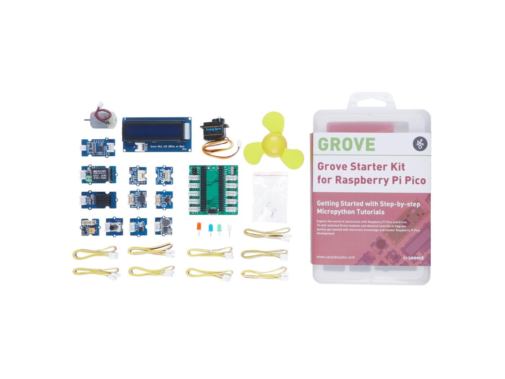
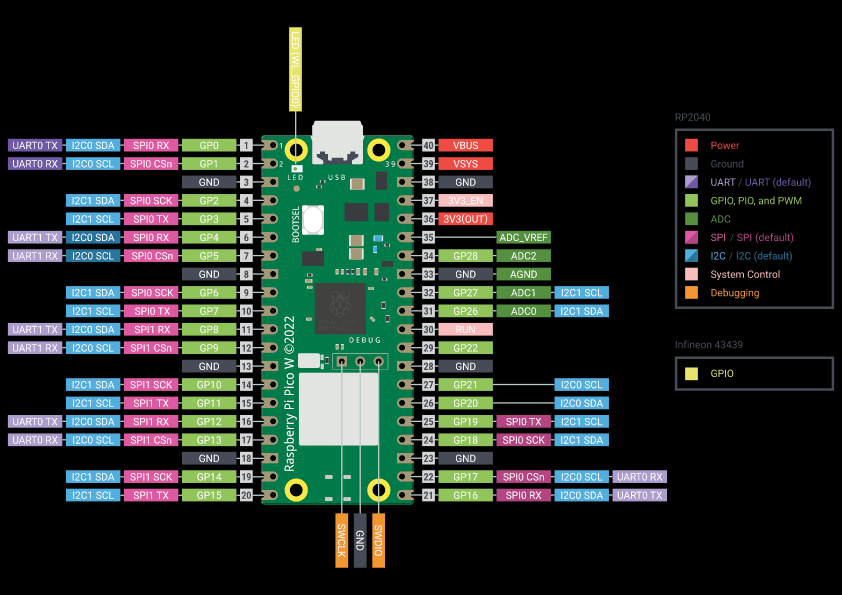
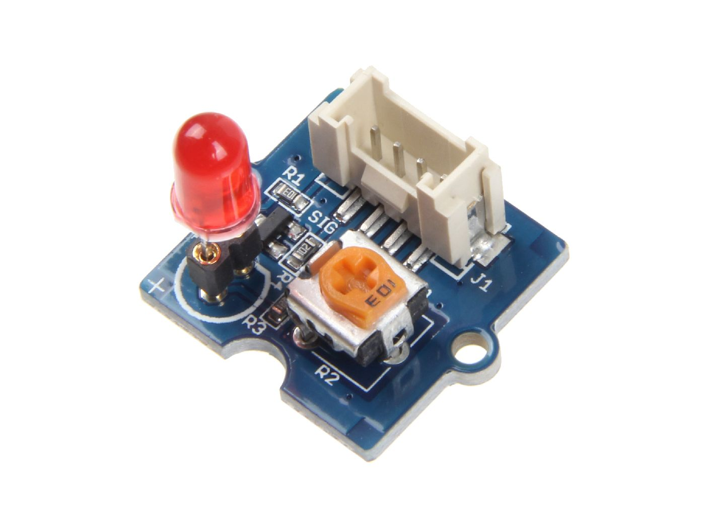
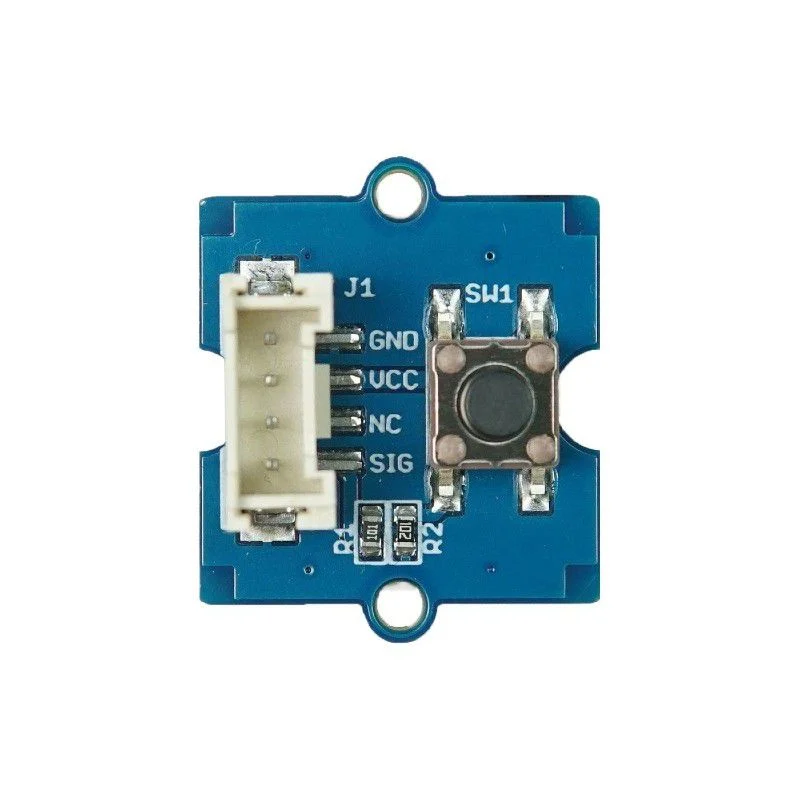

# GPIO

## Raspberry Pi Pico 2 W

Lors de nos projets, nous utiliserons comme microcontrôleur un Raspberry Pi Pico 2 W.

Contrairement à un Raspberry Pi classique, cette carte n'est pas un ordinateur à part entière. C'est une carte à microcontrôleur : elle exécute directement le programme qu'on lui envoie. Ce programme nous permettra notamment de contrôler les différents GPIO.

## Starter Kit

Dans notre cas, nous travaillerons avec le Grove Starter Kit.

[Documentation officielle du Grove Starter Kit](https://wiki.seeedstudio.com/Grove-Starter-Kit-for-Raspberry-Pi-Pico/)

Il s'agit d'un kit de développement pour le Raspberry Pi Pico qui fournit un ensemble de contrôleurs, de capteurs et de connectiques. Il nous permettra notamment de prendre en main les éléments suivants :

- module LED ;
- module bouton ;
- module potentiomètre ;
- moteur analog ?

**NB :** A COMPLETER

## MicroPico

Nos programmes seront écrits en MicroPython, une version allégée de Python adaptée aux microcontrôleurs.

Pour développer en MicroPython, deux choix se présentaient à nous : utiliser Thonny, un IDE spécialement conçu pour cela, ou utiliser Visual Studio Code, qui a été mon choix.

Pour ce faire, nous avons dû installer l'extension MicroPico.

## Envoi du programme avec MicroPico

Une fois le Raspberry Pi Pico branché, il faut exécuter la commande :

> MicroPico: Connect

Cette commande permet à l'extension de détecter notre Raspberry Pi Pico et de s'y connecter.

MicroPico va également générer un fichier nommé `.micropico`. Ce fichier sert simplement à identifier le projet MicroPico.

Nous pouvons ensuite envoyer et exécuter un seul fichier grâce au bouton **Run current file** :

Il est aussi possible d'envoyer un projet complet avec la commande :

> MicroPico: Upload Project to Pico

Cette commande peut parfois poser problème. Dans mon cas, j'ai donc mis en place le raccourci `F5`, qui lance directement l'envoi du projet. MicroPico envoie le contenu du dossier défini dans le paramètre `micropico.syncFolder`. Les fichiers et dépendances utilisés par le programme doivent donc se trouver dans ce dossier.

Une fois le projet envoyé, MicroPython exécute automatiquement `boot.py`, s'il existe, puis `main.py`. 

Le fichier `main.py` sert donc de point d'entrée principal du programme. 

Le raccourci `F5` ne cherche pas lui-même ce fichier : il envoie le projet, puis c'est MicroPython qui reconnaît et exécute `main.py`.

## Aperçu des différentes broches d'un Raspberry Pi Pico 2 W

## Module LED

## Module bouton

## Module potentiomètre

## Moteur
