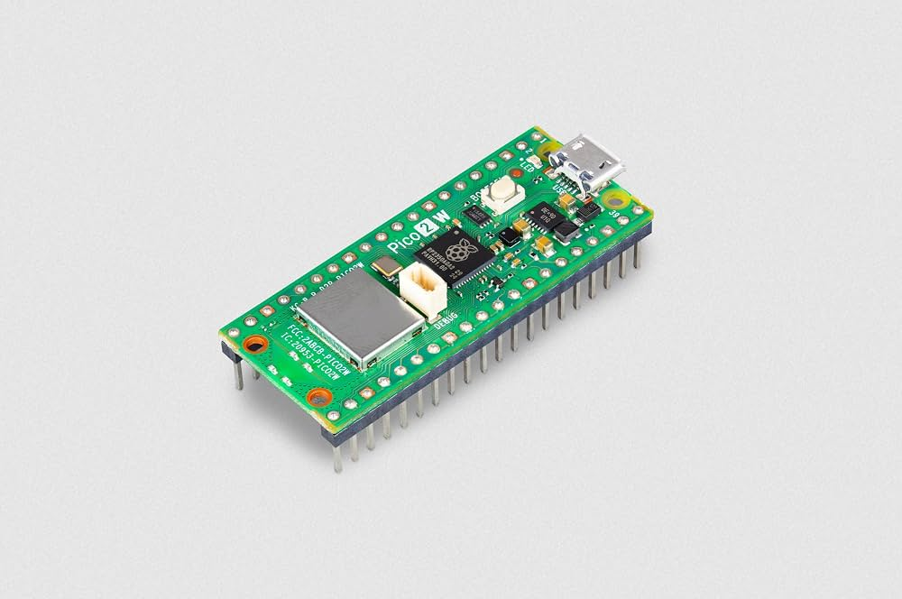
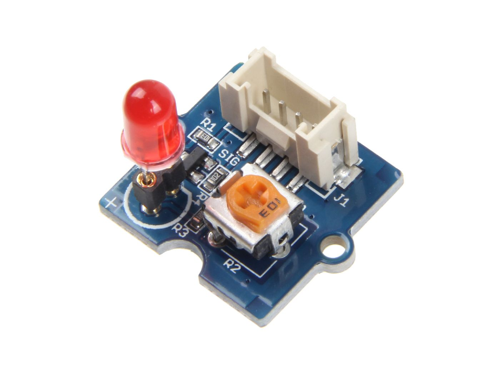
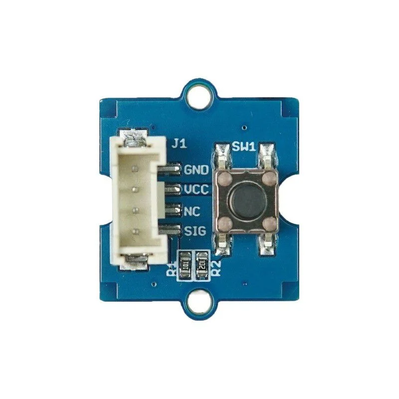
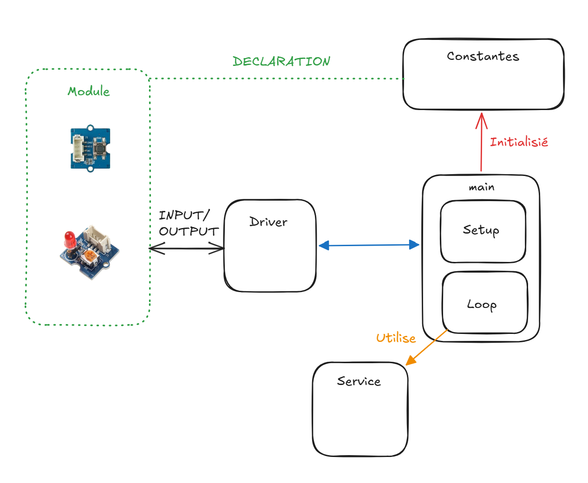

# Exercice 1 — Clignotement d'une LED avec un bouton-poussoir

## Objectif

Ce projet MicroPython utilise un **Raspberry Pi Pico 2 W**, une LED et un
bouton-poussoir. Chaque appui sur le bouton change le niveau de fonctionnement
de la LED : sa vitesse de clignotement évolue, elle peut s'éteindre ou exécuter
un effet lumineux.

Le programme comporte cinq niveaux. Il démarre au niveau 1 et, une fois le
dernier niveau atteint, un nouvel appui ramène au premier niveau.

## Matériel utilisé

### Raspberry Pi Pico 2 W



### Module LED Grove — Socket V1.7



### Module bouton Grove V1.3



## Branchement

| Composant | Broche du Pico | Mode |
|---|---:|---|
| LED | GPIO 18 | Sortie |
| Bouton-poussoir | GPIO 16 | Entrée |

Les broches sont configurées dans `constantes/pin.py`. Il suffit de modifier ce
fichier pour adapter le programme à un autre branchement.

## Organisation du code



```text
Exercice1/
├── constantes/
│   ├── config.py       # nombre de niveaux
│   ├── pin.py          # configuration des GPIO
│   └── time.py         # délai de base
├── drivers/
│   ├── button.py       # lecture du bouton
│   └── led.py          # contrôle de la LED
├── services/
│   ├── led_effect.py   # effet lumineux bonus
│   └── timer.py        # temporisations et écoute du bouton
├── main.py             # point d'entrée du programme
└── README.md
```

Cette séparation permet de ne pas mélanger la configuration matérielle, le
pilotage des composants et la logique de l'application.

## Fonctionnement

Le fichier `main.py` est organisé autour de deux fonctions :

1. `setup()` crée le timer, la LED et le bouton, puis injecte les dépendances
   nécessaires aux composants ;
2. `loop()` exécute la boucle principale, détecte les appuis et sélectionne le
   comportement correspondant au niveau courant.

Le niveau suivant est calculé avec un modulo :

```python
LevelNumber = LevelNumber % NUMBER_OF_LEVELS + 1
```

La valeur `NUMBER_OF_LEVELS`, définie dans `constantes/config.py`, permet de
modifier le nombre total de niveaux sans inscrire directement cette valeur dans
la logique principale.

### Comportement des niveaux

| Niveau | Délai entre deux changements d'état | Comportement |
|---:|---:|---|
| 1 | 2 s | Clignotement lent (état initial) |
| 2 | 1 s | Clignotement à 0,5 Hz |
| 3 | — | LED éteinte |
| 4 | 0,5 s | Clignotement à 1 Hz |
| 5 | Délai décroissant | Effet `TicTicBoom` avec accélération progressive |

Pour les niveaux classiques, le délai entre deux changements d'état est :

```python
delay = SLEEP_TIME / LevelNumber
```

Avec `SLEEP_TIME = 2`, cette formule donne les délais indiqués dans le tableau.
Les niveaux 3 et 5 possèdent un comportement particulier et n'utilisent pas ce
calcul pour commander la LED.

### Fréquence de clignotement

Une période complète comprend deux changements d'état : un allumage et une
extinction. Pour obtenir une fréquence de **0,5 Hz**, une période complète doit
durer deux secondes. La LED doit donc changer d'état toutes les secondes, comme
au niveau 2.

La relation utilisée est :

```text
fréquence = 1 / période
```

## Attente avec écoute du bouton

La méthode `sleep_listening()` de `services/timer.py` remplace une attente
totalement bloquante. Pendant le délai, elle vérifie continuellement l'état du
bouton :

- elle retourne `True` lorsque le délai se termine normalement ;
- elle retourne `False` lorsqu'un appui est détecté avant la fin du délai ;
- une courte pause de 100 ms après la détection réduit l'effet des rebonds
  mécaniques du bouton.

Cette méthode rend le changement de niveau plus réactif, y compris pendant un
clignotement lent.

## Effet bonus : `TicTicBoom`

Le niveau 5 lance l'effet défini dans `services/led_effect.py`. Le délai entre
les changements d'état diminue progressivement, ce qui donne l'impression que
la LED accélère.

L'effet utilise également `sleep_listening()`. Un appui sur le bouton peut donc
l'interrompre sans attendre la fin complète de l'animation.

## Modifications apportées

- ajout de cinq niveaux configurables avec `NUMBER_OF_LEVELS` ;
- ajout de `setup()` et `loop()` pour clarifier le cycle du programme ;
- calcul automatique du délai selon le niveau courant ;
- ajout de `sleep_listening()` pour surveiller le bouton pendant les attentes ;
- ajout d'une courte temporisation pour limiter les rebonds du bouton ;
- ajout du service `led_effect.py` et de l'effet accéléré `TicTicBoom` ;
- possibilité d'interrompre l'effet lumineux avec le bouton ;
- centralisation des broches, du délai de base et du nombre de niveaux dans le
  dossier `constantes/`.

## Lancement

1. Réaliser le branchement indiqué ci-dessus.
2. Copier le dossier `Exercice1` sur le Raspberry Pi Pico.
3. Exécuter `main.py` avec MicroPython.
4. Appuyer sur le bouton pour parcourir les différents niveaux.
