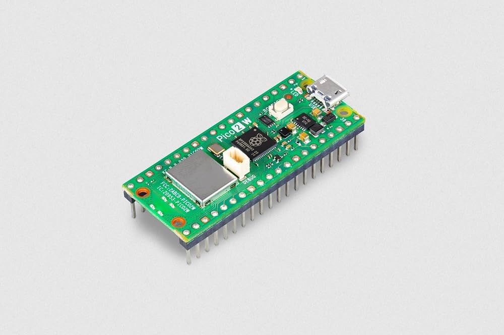
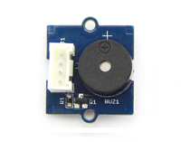
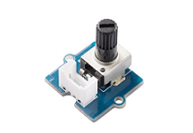
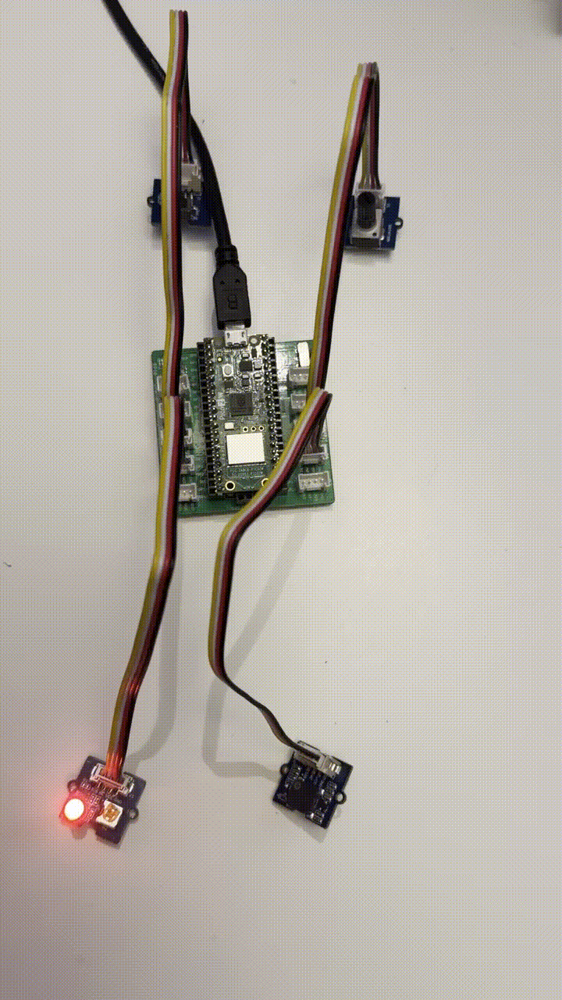
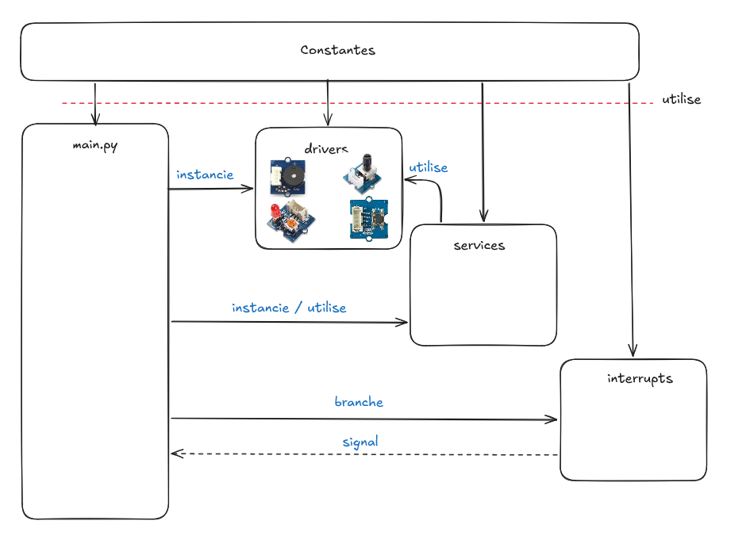

# Exercice 2 — Volume d'une mélodie

## Objectif

Ce projet MicroPython utilise un **Raspberry Pi Pico 2 W**, un buzzer et un
potentiomètre. Une mélodie est jouée en boucle par le buzzer et le
potentiomètre permet de modifier directement son volume.

Le programme comporte également deux bonus : un bouton-poussoir permet de
changer de mélodie et une LED clignote au rythme des notes.

## Matériel utilisé

### Raspberry Pi Pico 2 W



### Module buzzer Grove



### Module potentiomètre Grove



### Module LED Grove — Socket V1.7


### Module bouton Grove V1.3


## Branchement

| Composant | Broche du Pico | Mode |
|---|---:|---|
| Potentiomètre | GPIO 26 | Entrée analogique |
| Buzzer | GPIO 27 | Sortie PWM |
| LED | GPIO 18 | Sortie |
| Bouton-poussoir | GPIO 16 | Entrée avec interruption |

Les broches sont configurées dans `constants/pin.py`. Il suffit de modifier ce
fichier pour adapter le programme à un autre branchement.



## Organisation du code



```text
Exercice2/
├── constants/
│   ├── choice.py              # choix des mélodies
│   ├── note.py                # fréquences des notes
│   ├── pin.py                 # configuration des GPIO, de l'ADC et du PWM
│   ├── song.py                # fichier actuellement vide
│   └── time.py                # durée de l'anti-rebond
├── drivers/
│   ├── button.py              # pilote non utilisé dans main.py
│   ├── buzzer.py              # contrôle du buzzer
│   ├── led.py                 # contrôle de la LED
│   └── potentiometer.py       # lecture du potentiomètre
├── interrupts/
│   └── button_interrupt.py    # interruption du bouton
├── services/
│   ├── player_note.py         # lecture des notes et des mélodies
│   └── timer.py               # temporisations
├── main.py                    # point d'entrée du programme
└── README.md
```

Cette séparation permet de ne pas mélanger la configuration matérielle, le
pilotage des composants et la logique de l'application.

## Fonctionnement

Le fichier `main.py` est organisé autour de deux fonctions :

1. `setup()` crée le buzzer, le timer, le bouton, la LED et le potentiomètre,
   puis injecte les dépendances nécessaires au lecteur de notes ;
2. `loop()` exécute la boucle principale et joue en continu la mélodie
   sélectionnée.

Pour chaque note, le programme lit la valeur du potentiomètre :

```python
volume = self.myPotentiometer.getValue()
```

Cette valeur est ensuite envoyée au buzzer avec `duty_u16()`. Tourner le
potentiomètre modifie donc le rapport cyclique du signal PWM et, par conséquent,
le volume de la mélodie à partir de la note suivante.

### Mélodies disponibles

| Choix | Mélodie |
|---:|---|
| 1 | Frère Jacques |
| 2 | Au clair de la lune |

Les fréquences des notes sont définies dans `constants/note.py`. Les listes de
notes et leurs durées sont définies dans `services/player_note.py`.

## Effet bonus : changement de mélodie et LED rythmée

Le bouton-poussoir permet d'alterner entre les deux mélodies. Chaque appui
modifie le choix avec un modulo :

```python
self.choice = (self.choice % NUMBER_OF_CHOICE) + 1
```

Le choix est vérifié entre chaque note. Lorsqu'il change, la mélodie en cours
s'arrête et la nouvelle commence.

La LED s'allume pendant 90 % de la durée de chaque note, puis elle s'éteint
pendant les 10 % restants en même temps que le buzzer. Elle clignote ainsi au
rythme de la mélodie.

# Problème rencontrer

Il n'y a pas vraiment eu de problème rencontrée appart la mise en place de l'interrupteur qui semble mal architecturée tous a bien été
